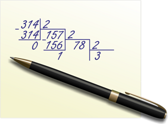

# Системи числення

Програма «Системи числення» розроблена для полегшення учням вивчати та
оцінювати свої знання з цієї теми, а вчителям перевіряти їх досягнення.

Усі результати проходження тестів зберігаются у БД MS Access.

## ISO файл для встановлення

[disk.iso](./disk.iso)

## Документація

[керівництво користувача](./doc.pdf)

## Мінімальні системні вимоги

- Операційна система Windows XP SP3
- Microsoft .NET Framework 3.0
- Microsoft Office 2003
- Microsoft Help Viewer 1.1
- Процесор 700 МГц
- Оперативна пам’ять 512 МБ
- 4 МБ вільного простору на диску (1,2 МБ програма + база даних)
- Монітор з роздільною здатністю 1366×768